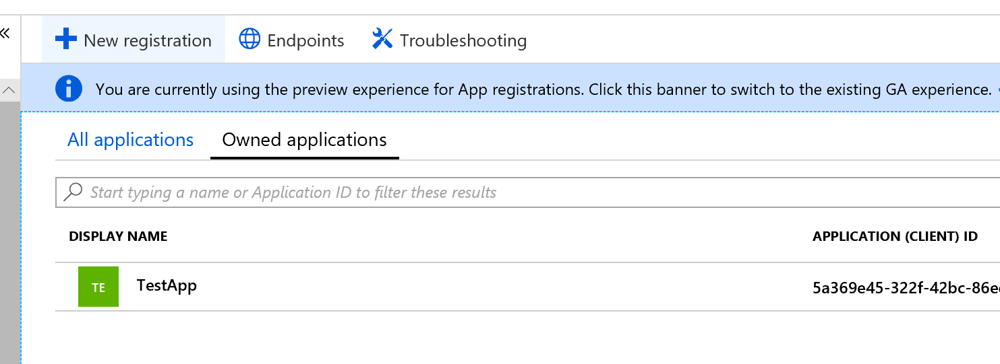
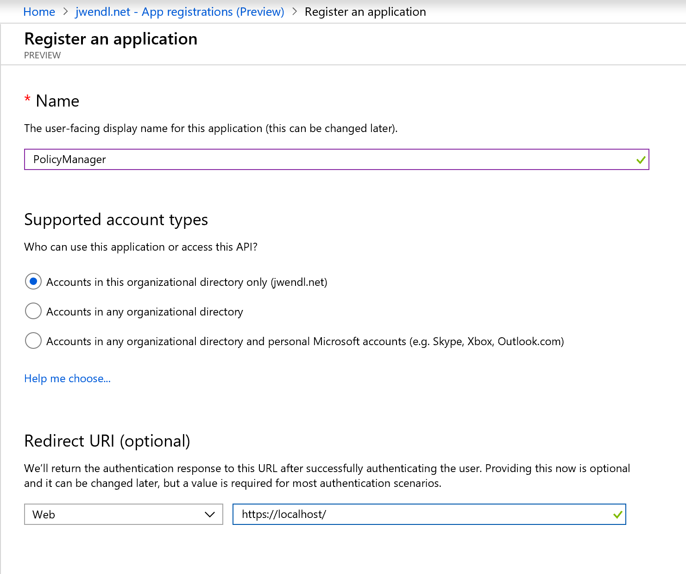
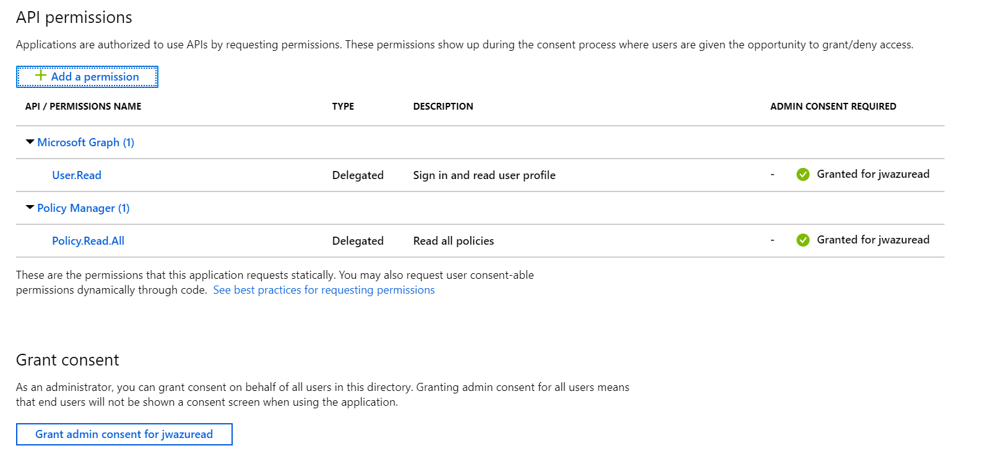
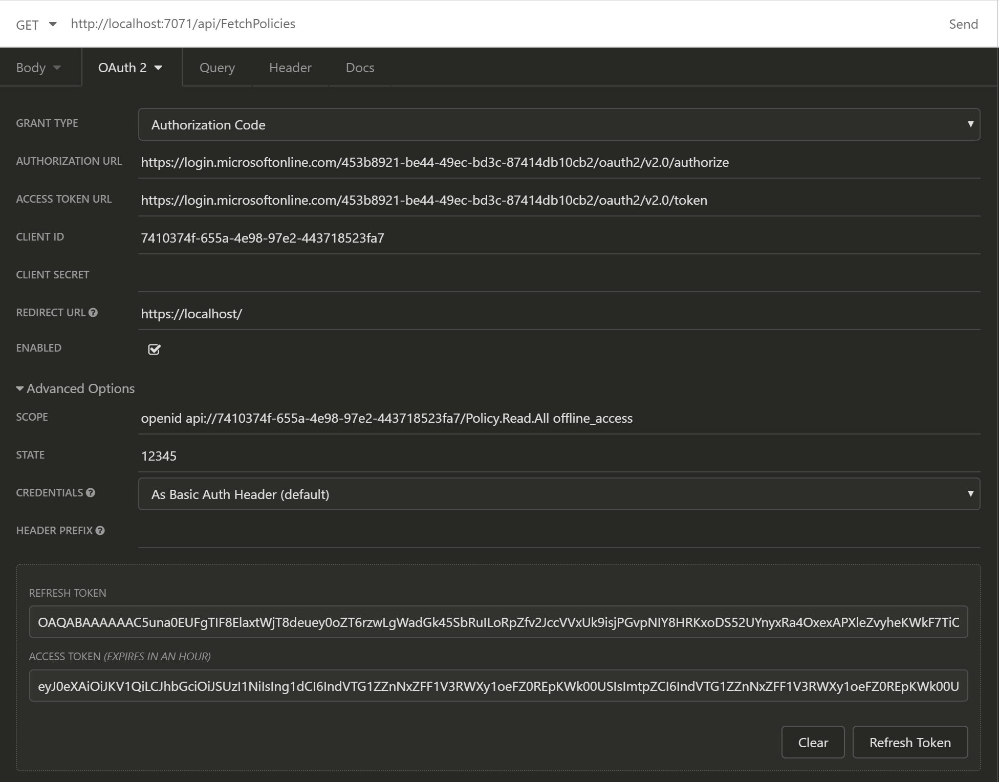

# Policy Manager

A policy manager using Azure Functions and Cosmos DB to manage contextual based resources using policies.

## Getting Started

1. Clone the repository
2. Run the [Azure Storage Emulator](https://docs.microsoft.com/en-us/azure/storage/common/storage-use-emulator)
3. Set the PolicyManager.Setup as the startup project
4. Run the application
5. Set the PolicyManager project as the startup project
6. Hit F5 and see the section below labelled "Example Api Usage"

## Example Api Usage

All requests below require a bearer token that is signed into your application created from above.

Add Policy

POST <http://localhost:7071/api/AddPolicy>

``` json
{
	"category": "Finance",
	"displayName": "Test Policy 01",
	"description": "This is a test policy rule",
	"rule": "if (userName == \"juswen@microsoft.com\") { return \"allow\"; } else { return \"deny\"; }"
}
```

Update User Policies

POST <http://localhost:7071/api/UpdateUserPolicies>

``` json
{
	"policyId": "b7751cc7-8219-4a8a-9b82-11e02ff49330",
	"policyCategory": "Finance"
}
```

Fetch Policies

GET <http://localhost:7071/api/FetchPolicies?category=Finance>

Results will look like:

``` json
[
	{
		"id": "fd84c5f7-f2de-4b3c-a923-ad703178b27a",
		"partition": "FINANCE",
		"createdBy": "juswen@microsoft.com",
		"createdDate": "2018-08-28T16:58:43.228285Z",
		"lastModifiedBy": "juswen@microsoft.com",
		"modifiedDate": "2018-08-28T16:58:43.2283878Z",
		"category": "Finance",
		"displayName": "Test Policy 01",
		"description": "This is a test policy rule",
		"rule": "if (userName == ""juswen@microsoft.com"") { return ""allow""; } else { return ""deny""; }"
	}
]
```

Fetch Policy

GET <http://localhost:7071/api/FetchPolicy?category=Finance&id=fd84c5f7-f2de-4b3c-a923-ad703178b27a>

Results will look like:

``` json
{
	"id": "fd84c5f7-f2de-4b3c-a923-ad703178b27a",
	"partition": "FINANCE",
	"createdBy": "juswen@microsoft.com",
	"createdDate": "2018-08-28T16:58:43.228285Z",
	"lastModifiedBy": "juswen@microsoft.com",
	"modifiedDate": "2018-08-28T16:58:43.2283878Z",
	"category": "Finance",
	"displayName": "Test Policy 01",
	"description": "This is a test policy rule",
	"rule": "if (userName == ""juswen@microsoft.com"") { return ""allow""; } else { return ""deny""; }"
}
```

Validate

GET <http://localhost:7071/api/Validate?context=/user/profile>

``` json
[
	{
		"id": "9f5bcd97-fa61-4aee-99bf-38c2c3875fd7",
		"category": "Finance",
		"policyName": "Test Policy 01",
		"description": "This is a test policy rule",
		"result": "allow"
	}
]
```

## Using the Service without a UI

Use something like [Insomnia](https://insomnia.rest/download/).

Create a new application under the [application registration portal](https://portal.azure.com/#blade/Microsoft_AAD_IAM/ActiveDirectoryMenuBlade/RegisteredAppsPreview).

First create a new application registration.



Then enter a name and use something like https://localhost as the Redirect URI.



Then select "Register"

Inside the "Authentication" tab on the next screen, be sure to check all of the suggested Redirect URIs too.


Under the "Expose an API" screen, we need to configure a custom scope (I use Policy.Read.All as an example).


Finally under API permissions, we need to add it to our permitted scopes. After doing that select "Grant admin consent for..."



Then inside Insomnia, create a new request.

From the new request screen, select the down arrow next to the "Auth" tab. Inside that drop down list, select OAuth 2.0.

For the Grant Type, leave selected as "Authorization Code".

For the Authorization URL use, https://login.microsoftonline.com/[tenantId]/oauth2/v2.0/authorize where _tenantId_ is found under the Overview tab on the Azure Portal (labelled as Directory (tenant) ID).

For the Access Token URL use, https://login.microsoftonline.com/[tenantId]/oauth2/v2.0/token where _tenantId_ is the same guid from above.

For the "Client ID" use the Application (client) ID field from the Azure Portal.

For the "Client Secret" we will need to create a new one in the Azure Portal (under the Certificates & secrets tab).

For the "Redirect URL" we will enter the one from above.

Under "Advanced Options" we will enter our scopes as: openid api://[clientId]/access_as_user where _clientId_ offline_access is from above.

Under the "State" we can enter anything here, it will be essentially passed to your API service.

The screen should look similar to:



For more information, please see [my blog article](https://jwendl.net/2018/11/06/using-insomnia-to-test-aad-v2/)

## Using Multiple Data Providers

This solution supports Cosmos DB and Azure Table Storage depending on the scenario. 

To enable Table Storage just enable the following in the local.settings.json file:
``` json
	"StorageConnectionString": "UseDevelopmentStorage=true",
```

To enable Cosmos DB just enable the following in the local.settings.json file:

``` json
	"DocumentEndpoint": "https://localhost:8081/",
	"DocumentKey": "C2y6yDjf5/R+ob0N8A7Cgv30VRDJIWEHLM+4QDU5DE2nQ9nDuVTqobD4b8mGGyPMbIZnqyMsEcaGQy67XIw/Jw==",
	"DatabaseId": "PolicyManager",
```
